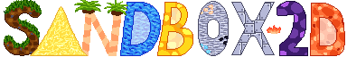

---
Sandbox-2D is an open-source 2D sandbox survival game where you can build, destroy and explore. You can download it for free on [Itch.io](https://acerxamj.itch.io/sandbox-2d).

## Table of Contents
- [Features](#features)
- [Controls](#controls)
- [Installation](#installation)
- [Usage](#usage)
- [Contributing](#contributing)
- [Credits](#credits)

## Features

The game is a WIP, so stay tuned for new features! Currently it includes;
- Building and destroying.
- Water, lava and sand physics.
- Player controller.
- World generation with multiple biomes.
- Lighting system.
- Survival mode.


## Controls

- A, D - move left/right
- SPACE - jump

- LEFT CLICK - place blocks
- RIGHT CLICK - destroy blocks
- MIDDLE CLICK - select a block

- E - Toggle inventory
- ESC - Toggle pause screen
- MINUS - zoom in
- EQUAL - zoom out
- CTRL+TAB - open console

- F11 - toggle fullscreen

## Installation
This project depends on Raylib 5.5 and SRU-Lib, which are fetched by CMake, and it uses C++17 standard. You must have CMake and a C++17 compiler installed to build this game.

#### Installation
1. Clone the repository (or download as ZIP if not using git):
```bash
git clone https://github.com/Acerx-AMJ/Sandbox-2D.git
```
2. Navigate in the directory (or manually):
```bash
cd Sandbox-2D
```
3. Build using CMake:
```bash
cmake -B build
cmake --build build
```
The executable will be found in `build/sandbox`. If something didn't work as expected, feel free to open an issue.

## Usage

Simply run the executable after building. Assets folder must be in the same directory in which the executable is ran. CMake does not place assets in the build folder and if you run it from there it will throw an error. That's why you must run from the project directory (Sandbox-2D/):
```bash
./build/sandbox
```

## Contributing

Feel free to fork and create PRs or issues. Please read [contribution guidelines](CONTRIBUTING.md) before doing so.
1. Fork the repository.
2. Create a new branch (don't use the braces):
```bash
git checkout -b [feature-name]
```
3. Make your changes.
4. Commit and push your changes:
```bash
git add . # Or, alternatively, select specific files to add
git commit -m "[commit-message]"
git push origin [feature-name]
```
5. Create a pull request.

## Credits
This project owes its success to the following people and organizations:

### Contributors
- The code was written by and sprites were made by Daniel Vishnevsky.
- Windows builds were made by Joseph Hyde.
- SFX by DTChords.

### Assets
- Thanks to Steve Matteson for creating the "Andy" font!
- Thanks to Google for creating the "Roboto" font!

### Third-party Libraries
- [Raylib](https://www.raylib.com/), which is used in everything from input and rendering to playing sounds and doing math.
- [SRU-Lib](https://github.com/Acerx-AMJ/SRU-Library), which is used for utilities for Raylib.
- [siv::PerlinNoise](https://github.com/Reputeless/PerlinNoise), which is used to generate worlds.

### License
This project is licensed under the [MIT License](LICENSE). Feel free to copy, edit and distribute the code.
